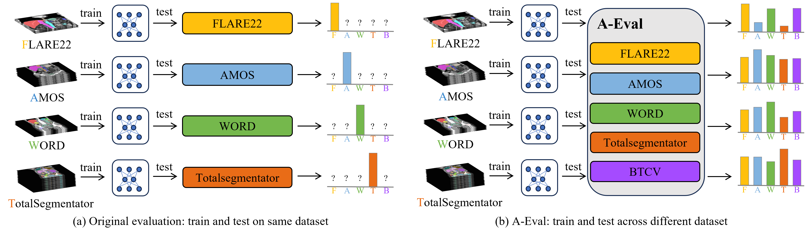

# A-Eval \[[Paper](https://arxiv.org/abs/2309.03906)]

  

## 🌟 Highlights
- 📊 A benchmark focused on cross-dataset generalizability in abdominal multi-organ segmentation.
- 🧠 In-depth analysis on model generalizability across different data usage scenarios and the role of model size.

## 📚 Datasets
We train models on the official sets of [FLARE22](https://flare22.grand-challenge.org/), [AMOS](https://amos22.grand-challenge.org/), [WORD](https://github.com/HiLab-git/WORD), and [TotalSegmentator](https://github.com/wasserth/TotalSegmentator), and evaluate them using their official **validation sets** as well as [BTCV](https://www.synapse.org/#!Synapse:syn3193805/wiki/217752)'s official training set.

> **Note**: While these datasets do have test sets, FLARE22, AMOS, and BTCV do not make their test labels publicly available. Therefore, for consistent evaluation, we use validation sets instead of test sets in A-Eval, regardless of label availability.

| **Dataset** | **Modality** | **# Train** | **# Test** | **# Organs** | **Region** |
|:-----------:|:------------:|:-----------:|:----------:|:------------:|:----------:|
| FLARE22     | CT           | 50 labeled   2000 unlabeled | 50 | 13 | North American   European |
| AMOS        | CT & MR      | 200 CT   40 MR | 100 CT   20 MR | 15 | Asian |
| WORD        | CT           | 100          | 20         | 16           | Asian     |
| TotalSegmentator | CT       | 1082         | 57         | 104          | European  |
| BTCV        | CT           | -            | 30         | 13           | North American |
| A-Eval Totals | CT & MR    | 1432 labeled CT   2000 unlabeled CT   40 MR | 257 CT   20 MR | 8  | North American   European   Asian |

To ensure a meaningful and fair comparison across datasets, we evaluate the models’ performance based on a set of eight organ classes shared by all five datasets. We unify these labels using an overlapped label system. The corresponding code for label systems and label conversion can be found in the repository: [`label_systems.py`](Evaluation/label_systems.py) and [`convert_label_2_overlap_label.py`](Evaluation/convert_label_2_overlap_label.py).
| Organ Class            | **FLARE22** | **AMOS** | **WORD** | **TotalSegmentator** | **BTCV** | **A-Eval** |
|:-----------------------|:-----------:|:--------:|:--------:|:--------------------:|:--------:|:----------:|
| Liver                  |      ✓      |    ✓     |    ✓     |          ✓           |    ✓     |     ✓      |
| Kidney Right           |      ✓      |    ✓     |    ✓     |          ✓           |    ✓     |     ✓      |
| Kidney Left            |      ✓      |    ✓     |    ✓     |          ✓           |    ✓     |     ✓      |
| Spleen                 |      ✓      |    ✓     |    ✓     |          ✓           |    ✓     |     ✓      |
| Pancreas               |      ✓      |    ✓     |    ✓     |          ✓           |    ✓     |     ✓      |
| Aorta                  |      ✓      |    ✓     |    ✗     |          ✓           |    ✓     |     ✗      |
| Inferior Vena Cava     |      ✓      |    ✓     |    ✗     |          ✓           |    ✓     |     ✗      |
| Adrenal Gland Right    |      ✓      |    ✓     |    ✗     |          ✓           |    ✓     |     ✗      |
| Adrenal Gland Left     |      ✓      |    ✓     |    ✗     |          ✓           |    ✓     |     ✗      |
| Gallbladder            |      ✓      |    ✓     |    ✓     |          ✓           |    ✓     |     ✓      |
| Esophagus              |      ✓      |    ✓     |    ✓     |          ✓           |    ✓     |     ✓      |
| Stomach                |      ✓      |    ✓     |    ✓     |          ✓           |    ✓     |     ✓      |
| Duodenum               |      ✓      |    ✓     |    ✓     |          ✓           |    ✗     |     ✗      |

## 🏆 Results
### 💡 DSC
| Train/Test      | FLARE22  | AMOS CT  | WORD     | TotalSeg | BTCV     | CT Mean  | AMOS MR  | All Mean  |
|-----------------|----------|----------|----------|----------|----------|----------|----------|-----------|
| FLARE22 w/o PL  | 89.20    | 76.53    | 85.94    | 74.06    | 86.11    | 82.37    | 24.77    | 72.77     |
| FLARE22 w/ PL   | 91.98    | 87.53    | 87.15    | 85.55    | 87.35    | 87.91    | 42.74    | 80.38     |
| AMOS CT         | 89.14    | 93.02    | 89.01    | 86.39    | 86.84    | 88.88    | 70.08    | 85.75     |
| AMOS MR         | 61.47    | 73.97    | 45.30    | 48.08    | 77.60    | 61.28    | 91.73    | 66.36     |
| AMOS CT+MR      | 89.81    | 93.24    | 89.36    | 88.42    | 87.66    | 89.70    | 92.72    | 90.20     |
| WORD            | 86.86    | 87.53    | 90.92    | 80.58    | 84.69    | 86.12    | 27.38    | 76.33     |
| TotalSeg        | 90.32    | 89.65    | 86.30    | 95.12    | 87.73    | 89.82    | 38.72    | 81.31     |
| Joint Train     | 91.98    | 92.42    | 88.88    | 93.87    | 88.90    | 91.21    | 90.87    | 91.15     |

### 💡 NSD
| Train/Test      | FLARE22  | AMOS CT  | WORD     | TotalSeg | BTCV     | CT Mean  | AMOS MR  | All Mean  |
|-----------------|----------|----------|----------|----------|----------|----------|----------|-----------|
| FLARE22 w/o PL  | 90.19    | 80.25    | 90.76    | 76.56    | 89.28    | 85.41    | 23.96    | 75.17     |
| FLARE22 w/ PL   | 93.46    | 90.92    | 92.01    | 88.29    | 90.94    | 91.12    | 44.19    | 83.30     |
| AMOS CT         | 89.49    | 96.47    | 94.82    | 89.28    | 91.65    | 92.34    | 72.92    | 89.11     |
| AMOS MR         | 59.97    | 48.69    | 43.93    | 48.09    | 61.61    | 52.26    | 95.22    | 59.42     |
| AMOS CT+MR      | 90.46    | 96.80    | 95.18    | 91.36    | 92.53    | 93.27    | 96.58    | 93.82     |
| WORD            | 88.73    | 92.34    | 95.75    | 83.47    | 88.74    | 89.81    | 30.75    | 79.96     |
| TotalSeg        | 91.96    | 94.02    | 92.46    | 97.33    | 92.72    | 93.70    | 40.44    | 84.82     |
| Joint Train     | 93.58    | 96.46    | 95.28    | 96.10    | 93.80    | 95.04    | 95.28    | 95.08     |

### 💡 Visualization

  

## 🎫 License
This project is released under the [Apache 2.0 license](LICENSE). 

## 🙏 Acknowledgement
- Special thanks go to the creators and maintainers of the public datasets that made our research possible:
  - [FLARE22](https://flare22.grand-challenge.org/)
  - [AMOS](https://amos22.grand-challenge.org/)
  - [WORD](https://github.com/HiLab-git/WORD)
  - [TotalSegmentator](https://github.com/wasserth/TotalSegmentator)
  - [BTCV](https://www.synapse.org/#!Synapse:syn3193805/wiki/217752)
- Thanks to the SOTA framework of: [nnUNet](https://github.com/MIC-DKFZ/nnUNet):

## 👋 Hiring & Global Collaboration
- **Hiring:** We are hiring researchers, engineers, and interns in General Vision Group, Shanghai AI Lab. If you are interested in Medical Foundation Models and General Medical AI, including designing benchmark datasets, general models, evaluation systems, and efficient tools, please contact us.
- **Global Collaboration:** We're on a mission to redefine medical research, aiming for a more universally adaptable model. Our passionate team is delving into foundational healthcare models, promoting the development of the medical community. Collaborate with us to increase competitiveness, reduce risk, and expand markets.
- **Contact:** Junjun He(hejunjun@pjlab.org.cn), Jin Ye(yejin@pjlab.org.cn), and Tianbin Li (litianbin@pjlab.org.cn).